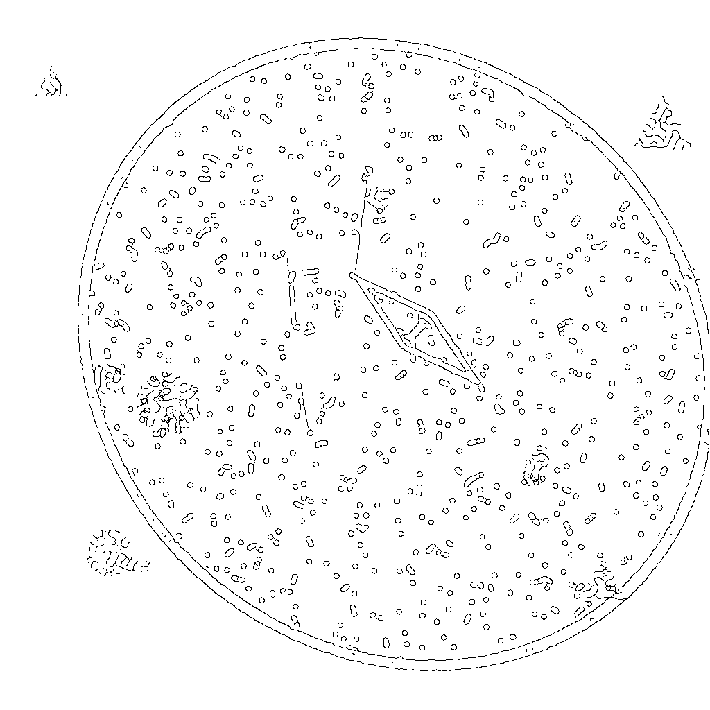
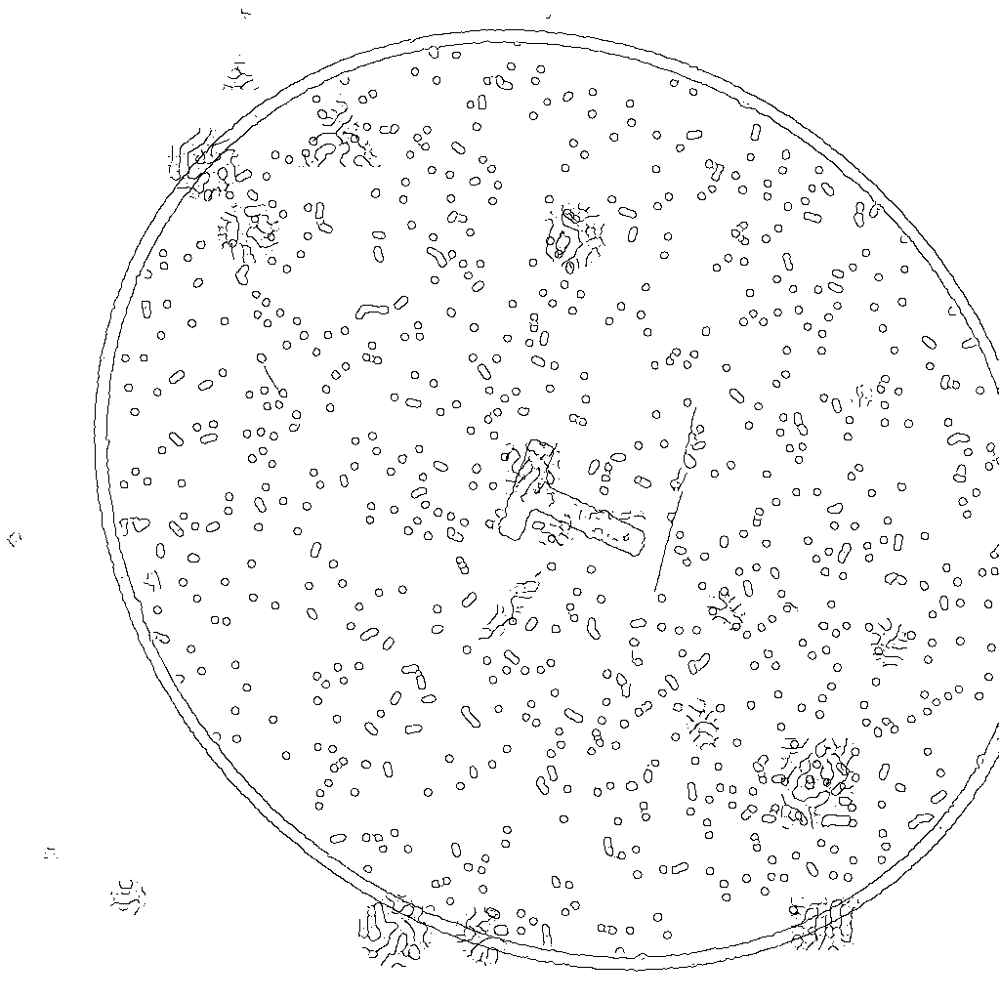
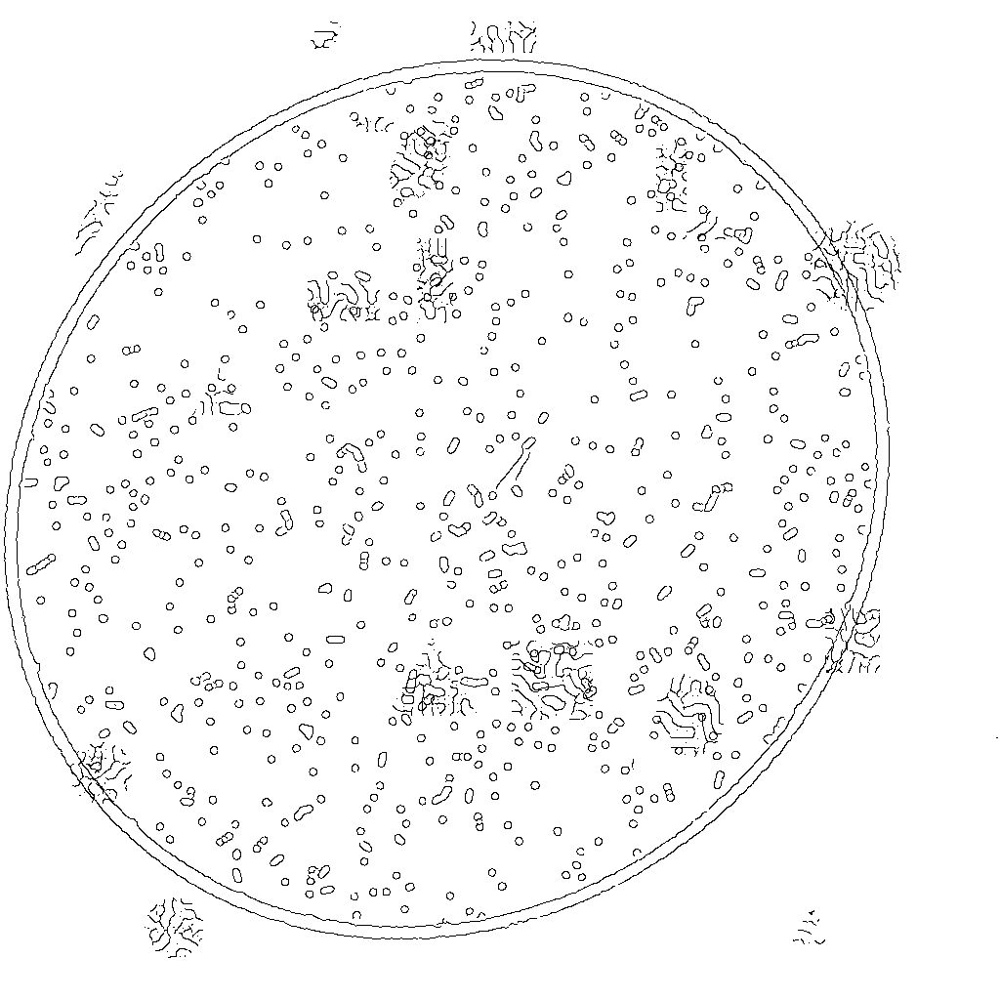
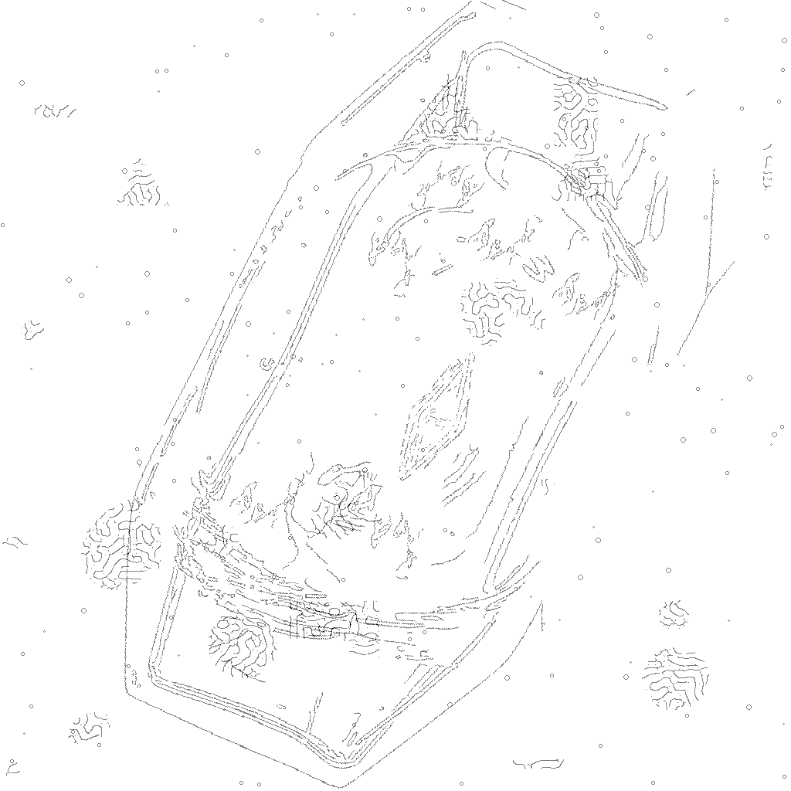

# Identifying glass manufacturing marks with machine learning
This repository contains Python codes for "Identifying glass manufacturing marks with machine learning" poster presented by Katherine Peck and Grant Snitker at the 91st Annual Meeting of the Society for American Archaeology, San Francisco, CA.

## Summary
Glass vessels can be powerful tools for dating archaeological sites. Embossed marks associated with bottle manufacturers (also referred to as makers' marks) can help archaeologists date artifact manufacture to within a decade in some cases. Humans can recognize and classify bottle marks effectively. Prior research, particularly by members of the [Bottle Research Group](https://secure-sha.org/bottle/), has produced impressive reference documents that help archaeologists identify and date marks. However, a reliable computer vision model could be applied at scale to collections of object photographs or deployed in the field to assist in recognizing unusual marks. The best computer vision models are trained on many (hundreds or thousands) of images. Although glass bottles are common in the archaeological record, we could not locate a sufficient number of photographs of a single mark type. Therefore, for this pilot study, we took a data augmentation approach. We developed a simulated training dataset of images featuring the same Diamond-I mark modified to add variation and mimic the 
appearance of the mark in images after a [Canny edge detection algorithm](https://scikit-image.org/docs/stable/auto_examples/edges/plot_canny.html) was applied. We then used these simulated images to train a computer vision ([Mask R-CNN](https://doi.org/10.48550/arXiv.1703.06870)) model and assessed its performance on a dataset of 192 real images.

Ultimately, we found that these trained models could not reliably detect the Diamond- I mark (although they could in certain circumstances). These models will improve substantially with a comprehensive dataset 
of real bottles featuring the Diamond-I mark (and an array of true negatives). At present, while simulated and modified real data represent an interesting approach for developing model training datasets, for applications like this, they may be better applied to augment datasets composed of real images.

This repository contains the training dataset simulation code used to generate this poster's training datasets. The "Model training" section below also discusses how we applied the PyTorch Object Detection tutorial code to train our final models.

## Simulated image code
```utils/process_and_simulate.py``` contains several functions: ```circular_image()```, ```true_negative_logo()```, ```true_negative_blank()```, and ```modify_real_data()```. The first three functions create fully simulated training datasets while the latter modifies a real filtered bottle image to add a new mark. The ```simulate.py``` script in the main folder calls these functions and, with additional user-provided parameters surrounding training dataset size and characteristics, creates a folder of images and masks appropriate for model training. ```test-data``` includes an example of what the training dataset options look like for both the images and the masks.

These functions are described in more detail below. 

### circular_image()
```circular_image()``` requires several inputs:
* ```logo``` - file path to the logo which will be added to the simulated bottle and later run through the edge detector. An example is included in this repository at ```figs/Diamond_I.jpg```.
* ```image_size``` - a tuple representing the output image dimensions; (512, 512) by default.
* ```shape_buffer``` - the degree of dilation applied to simulated object edges; 5 by default.
* ```stipple``` - should randomly placed circular dots be added to the image? ```True``` by default.
* ```invert_logo``` - if the added logo image is black on white, this is ```True```. If not, set to ```False```.
* ```scale_range_min``` and ```scale_range_max``` - the logo will be randomly resized before placing, by a factor within the range of these two numbers.
* ```max_removal``` - to obscure and add variation to the logo, the function will remove randomly sized circles from the logo, up to this radius (3 by default).

The function then opens the logo image, adds some noise, resizes the logo, and places it within a randomly generated circle. Additional randomly generated circles are added to the edge of the image, the image is blurred, and then both the image and a mask of the logo are randomly rotated and skewed. Pieces of additional simulated noise are added on top of the image, then the image and mask (binary array where pixels overlying the logo are "1s" and all other pixels are 0) are exported as ```numpy``` arrays.



### true_negative_logo()
This function uses the same parameters and procedures as above, but rather than taking a single logo file path as an input, it takes a folder path. Then, the function randomly selects an image from within the folder to add it to a simulated bottle. An example true negative image can be found at ```figs/True_negative_example.jpg```. While creating an approximation of a real makers' mark might be most helpful at teaching the model to differentiate between logos, any binary image (letters, numbers, shapes) will be useful here.



### true_negative_blank()
This function creates the simulated bottle using the same steps as the previous functions but does not add a logo.



### modify_real_data()
This function takes a real filtered bottle image and adds a new simulated mark. In addition to the parameters discussed above, this function requires some additional inputs:
* ```real_canny``` - file path to real Canny-filtered bottle image.
* ```logo_to_add``` - file path to the logo that will be added. Because this procedure starts with the filtered image, this logo should be black-on-white and should match (as best as possible) the way a logo might look after edge detection. An example can be found at ```figs/Diamond_I_Canny.jpg```. This image was create by Canny processing a Diamond-I mark from outside of the testing dataset, then manually editing in Inkscape to add additional noise. In future iterations, this will be done within the function using Canny edge detection and elastic transforms. This parameter can also be set to ```None``` to create a true negative image.
* ```TN``` - ```False``` by default. If ```True```, the image is treated as a true negative, and a blank mask will be returned. Otherwise, an output mask will be created around the added logo. In addition, the logo will be first Canny filtered before application (this may change in future function iterations).



True negative options look similar to the above, but added to this real base image.

## Image processing
To apply the trained model (see below) to a real image, the images must be processed to match the simulated data as much as possible. The best approach we found is to convert the image to grayscale, apply contrast adjustment with a histogram equalization method, and then apply the Canny edge filter. ```process_image()``` in ```utils/process_and_simulate.py``` applies these processing steps to a single image using functions in the ```scikit-image``` library. The output array can be saved as a JPEG using ```skimage.io.imsave()```.

## Model training
We trained our Mask R-CNN models using the PyTorch implementation. We used the code in the [PyTorch Object Detection tutorial](https://docs.pytorch.org/tutorials/intermediate/torchvision_tutorial.html), which discusses how to continue training a pre-trained object detection model for a specific object type. We modified the code slightly, but because the code is so close to the existing PyTorch code we did not include it here. This section summarizes the adjustments we made.

The main difference between the tutorial and our training procedure is that we added an additional data augmentation to the simulated training dataset. The tutorial's class already includes a ```self.transforms``` attribute:

```
class SimulatedBottleDataset(torch.utils.data.Dataset):
    def __init__(self, datafolder, transforms):
        self.datafolder = datafolder
        self.transforms = transforms
        self.imgs = list(sorted(os.listdir(os.path.join(datafolder, "images"))))
        self.masks = list(sorted(os.listdir(os.path.join(datafolder, "masks"))))
```

When creating the dataset to train the model, as in the tutorial, we pass the function ```get_transform()``` as the transform:

```
dataset = SimulatedBottleDataset(f'{training_data_folder}/{dataset_id}', get_transform(train=True))
```

This transform converts the images and mask data to tensors and, to the training dataset, applies a list of ```torchvision``` transforms.

```
def get_transform(train):
    transforms = []
    if train:
        transforms.append(T.RandomHorizontalFlip(0.5))
        #Not included in original implementation:
        transforms.append(T.ElasticTransform(alpha = 100))
    transforms.append(T.ToDtype(torch.float, scale=True))
    transforms.append(T.ToPureTensor())
    return T.Compose(transforms)
```

We added this [elastic transform](https://docs.pytorch.org/vision/main/auto_examples/transforms/plot_transforms_illustrations.html#elastictransform) option to make the final images better match the Canny edge detection output.

The object detection tutorial only trains the model for 2 epochs. During model development we experimented with training the model from 5-25 epochs. Because there is so little variability within the training dataset, we found that models trained for longer than 5-10 epochs were subject to overfitting.

After training, we save the trained model as a .pt file using:

```
torch.save(model.state_dict(), weights_path)
```

To apply this saved model to new images (as shown in the tutorial), load the weights path as shown below before setting the model to evaluation mode:

```
model = get_model_instance_segmentation(2)
device = torch.device("cuda:0" if torch.cuda.is_available() else "cpu")
if device == "cuda":
    checkpoint = torch.load(weights_path)
else:
    checkpoint = torch.load(weights_path, map_location=torch.device('cpu'))
model.load_state_dict(checkpoint)
model.to(device)
```

The model needs to be applied to Canny filtered images. Ensure that any images used for prediction have been run through the ```process_image()``` function first.